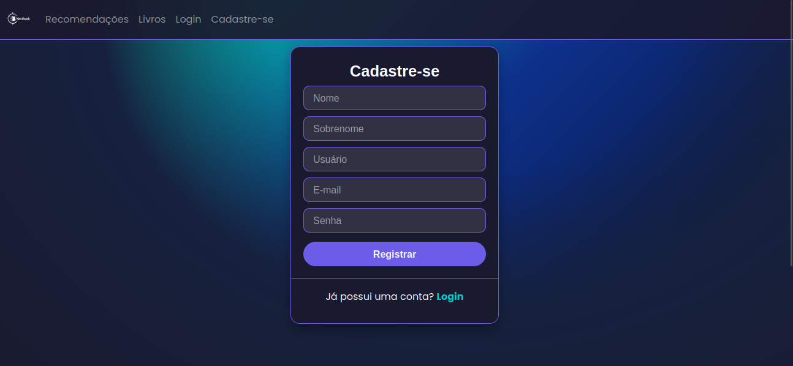
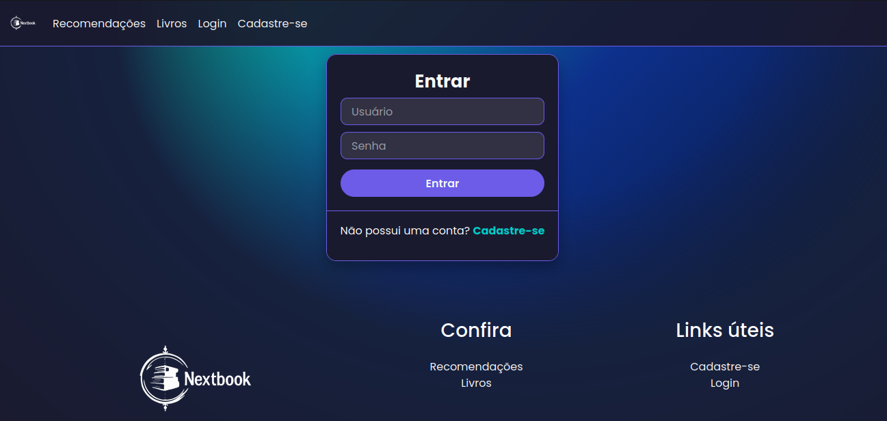
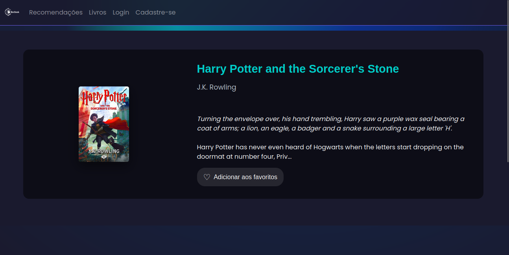

# NextBook

**Conteúdo da Disciplina**: Grafos 1

## Alunos
|Matrícula | Aluno |
| -- | -- |
| 22/1022720  | Rayene Ferreira Almeida |
| 17/0108341 | Levi de Oliveira Queiroz |

## Sobre 
O NextBook propõe um sistema de recomendação de livros que se baseia no gosto do usuário, oferecendo sugestões personalizadas nos ivros favoritos do usuário. Por meio de um grafo de relacionamento entre títulos e gêneros, o sistema permite que o usuário selecione seus livros favoritos, retornando livros que atendem a esses critérios.


## Screenshots

### Cadastro


### Login


### Home


### Catálogo de Livros


### Recomendações 


### Perfil


## Pré-requisitos

**Linguagem**: Python<br>
**Versão**: 3.12.3 ou superior<br>
**Framework**: Django<br>

## Instalação

Clone o repositório e instale as dependências:


### Clone o projeto
```git clone https://github.com/seu-usuario/seu-repo.git```
```cd seu-repo ```

### (Opcional) Crie e ative um ambiente virtual
```python -m venv venv```

### Instale as dependências
```pip install -r requirements.txt```

### Execute as migrações
```python manage.py migrate```

### (Opcional) Crie um superusuário
```python manage.py createsuperuser```

### Rode o servidor
```python manage.py runserver```


<div align="center">
  <a href="https://youtu.be/gk3Wuhi4WjE">
    
  </a>
</div>

<p align="center">
  <b>Autor:</b>
  <a href="https://github.com/rayenealmeida">Rayene Almeida</a> e 
  <a href="https://github.com/LeviQ27">Levi Queiroz</a>
</p>

